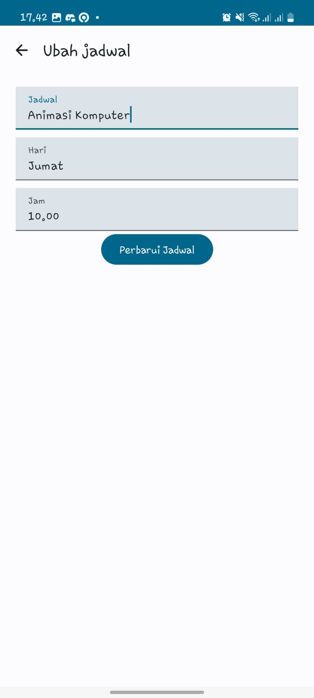

# UAS MOBILE COMPUTING

* Nama : Muhammad Alfin Khaerudin
* NIM : 13131621003
* Prodi : Ilmu Komputer 2021
* Matkul : Mobile Computing

## Deskripsi Aplikasi Japel.edu
Aplikasi Japel.edu adalah aplikasi mobile yang dirancang untuk memudahkan pengguna dalam mengatur dan mengelola jadwal pelajaran mereka dengan cara yang efisien dan user-friendly. Untuk implementasi dari fitur yang ada secara lengkap, bisa dilihat pada bagian [Sini](https://github.com/MalfinK/UASMuhammadAlfinKhaerudin/blob/master/Dokumentasi/Dokumen%20Tertulis%20Project%20UAS%20Muhammad%20Alfin%20Khaerudin.pdf).

## Video Aplikasi
Untuk video demo dari aplikasi ini, bisa dilih pada link berikut: [Video Demo Japel.edu](https://youtu.be/YJ3NGZvOo0I)

## Screenshot Aplikasi
Berikut adalah beberapa screenshot dari aplikasi Japel.edu:

